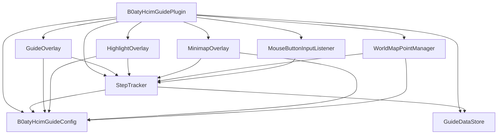

# Design Document: B0aty HCIM Guide Overlay

## Overview

This plugin provides an in-game overlay for RuneLite that guides players through B0aty's HCIM Guide V3. It renders a draggable panel showing step instructions, highlights relevant game entities (NPCs, objects, ground items, inventory items), places world map markers, and shows minimap indicators for nearby entities.

The plugin follows standard RuneLite plugin architecture: a central `Plugin` class orchestrates configuration, overlays, and game event subscriptions. Guide data is embedded as a JSON resource loaded at plugin startup. Step navigation is persisted via RuneLite's `ConfigManager`.

## Third Party Client Guidelines Compliance

This plugin complies with Jagex's [Third Party Client Guidelines](https://oldschool.runescape.wiki/w/Update:Third_Party_Client_Guidelines). Specifically:

- **No combat assistance**: The plugin does not provide attack prediction, prayer switching indicators, boss mechanic timing, or positional guidance during combat. Entity highlights are purely navigational (guiding the player to the correct NPC/object for a guide step) and are never used to indicate combat targets or mechanics.
- **No menu modifications**: The plugin does not add, remove, reorder, or modify any menu entries. No actions are sent to the server by the plugin.
- **No interface manipulation**: The overlay is a standard RuneLite `OverlayPanel` rendered above the scene. It does not unhide, move, or resize any game interface components or click zones.
- **No PvP assistance**: The plugin provides no information about other players, opposing clans, freeze timers, or opponent targeting.
- **Mouse button bindings**: The configurable mouse buttons only advance/retreat the plugin's internal step tracker. They do not trigger any game actions or interact with the game client's input system beyond consuming the event for plugin navigation.

Design constraints enforced:
1. Entity highlights MUST NOT be applied to entities in combat contexts (e.g., boss fights, PvP)
2. The plugin MUST NOT intercept or modify any game input that would result in server-side actions
3. The overlay MUST NOT overlap or modify any game interface click zones

## Architecture



The plugin uses RuneLite's dependency injection (Guice) to wire components. Game events are handled via `@Subscribe` annotated methods on the plugin class, which delegates to the appropriate subsystem.

## Components and Interfaces

### B0atyHcimGuidePlugin

The main plugin class. Extends `net.runelite.client.plugins.Plugin`.

Responsibilities:
- Lifecycle management (`startUp`, `shutDown`)
- Event subscription (game tick, config changes, menu events)
- Registers/unregisters overlays and input listeners

### B0atyHcimGuideConfig

Extends `net.runelite.client.config.Config`. Defines all user-configurable settings.

```java
@ConfigGroup("b0atyhcimguide")
public interface B0atyHcimGuideConfig extends Config {
    @ConfigItem(keyName = "highlightColor", name = "Highlight Color", description = "Color for entity highlights")
    default Color highlightColor() { return Color.CYAN; }

    @ConfigItem(keyName = "showOverlay", name = "Show Overlay", description = "Toggle overlay visibility")
    default boolean showOverlay() { return true; }

    @ConfigItem(keyName = "enableHighlighting", name = "Enable Highlighting", description = "Toggle entity highlighting")
    default boolean enableHighlighting() { return true; }

    @ConfigItem(keyName = "enableWorldMap", name = "Enable World Map Markers", description = "Toggle world map markers")
    default boolean enableWorldMap() { return true; }

    @ConfigItem(keyName = "currentStep", name = "Current Step", description = "Current step index", hidden = true)
    default int currentStep() { return 0; }

    @ConfigItem(keyName = "nextStepMouseButton", name = "Next Step Mouse Button", description = "Mouse button to advance step")
    default MouseButton nextStepMouseButton() { return MouseButton.NONE; }

    @ConfigItem(keyName = "prevStepMouseButton", name = "Previous Step Mouse Button", description = "Mouse button to go back")
    default MouseButton prevStepMouseButton() { return MouseButton.NONE; }
}
```

### GuideDataStore

Loads and provides access to the embedded guide data.

```java
public class GuideDataStore {
    List<GuideStep> getAllSteps();
    GuideStep getStep(int index);
    int getTotalSteps();
    List<String> getSectionNames();
    int getFirstStepOfSection(String sectionName);
}
```

Data is loaded from a JSON resource file (`guide_data.json`) bundled in the plugin JAR. Parsing uses Gson.

### StepTracker

Manages current step state and navigation logic.

```java
public class StepTracker {
    GuideStep getCurrentStep();
    int getCurrentStepIndex();
    void nextStep();
    void previousStep();
    void jumpToStep(int index);
    void jumpToSection(String sectionName);
    void addStepChangeListener(StepChangeListener listener);
}
```

Persists current step index to `B0atyHcimGuideConfig.currentStep` via `ConfigManager`. Fires change events when the step changes so overlays and highlights update.

### GuideOverlay

Extends `net.runelite.client.ui.overlay.OverlayPanel`. Renders the step info panel.

Displays:
- Current section name
- Step number / total steps
- Instruction text
- Next/Previous navigation buttons
- Section selector dropdown

Configured as `ABOVE_SCENE` with `DYNAMIC` priority and moveable position.

### HighlightOverlay

Extends `net.runelite.client.ui.overlay.Overlay`. Renders entity highlights in the game scene.

- NPCs: colored outline via `modelOutlineRenderer`
- Objects: colored outline via `modelOutlineRenderer`
- Ground items: colored tile highlight
- Inventory items: colored box around inventory slot

Subscribes to step changes to update the set of highlighted entity IDs.

### MinimapOverlay

Extends `net.runelite.client.ui.overlay.Overlay` with `OverlayLayer.ABOVE_WIDGETS` and `OverlayPosition.DYNAMIC`.

Renders colored dots on the minimap at positions of highlighted entities within render distance.

### WorldMapPointManager

Manages world map point markers using RuneLite's `WorldMapPointManager`.

```java
public class WorldMapPointManager {
    void updateMarker(WorldPoint location, String tooltip);
    void clearMarker();
}
```

### MouseButtonInputListener

Implements `net.runelite.client.input.MouseListener`. Listens for configured mouse button presses and triggers step navigation.

### MouseButton Enum

```java
public enum MouseButton {
    NONE, MOUSE4, MOUSE5;
}
```

## Data Models

### GuideStep

```java
public class GuideStep {
    private int stepNumber;
    private String section;
    private String instruction;
    private List<EntityReference> entities;
    private WorldPoint location; // nullable, for world map marker
}
```

### EntityReference

```java
public class EntityReference {
    private EntityType type;
    private int gameId; // NPC ID, Object ID, or Item ID
}
```

### EntityType

```java
public enum EntityType {
    NPC,
    OBJECT,
    GROUND_ITEM,
    INVENTORY_ITEM
}
```

### Guide Data JSON Format

```json
[
  {
    "stepNumber": 1,
    "section": "Tutorial Island",
    "instruction": "Talk to the Gielinor Guide",
    "entities": [
      { "type": "NPC", "gameId": 3308 }
    ],
    "location": { "x": 3094, "y": 3107, "plane": 0 }
  }
]
```

### StepChangeListener

```java
@FunctionalInterface
public interface StepChangeListener {
    void onStepChanged(GuideStep newStep, int newIndex);
}
```


## Correctness Properties

*A property is a characteristic or behavior that should hold true across all valid executions of a system — essentially, a formal statement about what the system should do. Properties serve as the bridge between human-readable specifications and machine-verifiable correctness guarantees.*

### Property 1: Guide data structural completeness

*For any* step in the loaded guide data, it must have a non-negative step number, a non-empty section name, a non-empty instruction string, and for each entity reference within that step, a valid EntityType and a positive game ID.

**Validates: Requirements 1.2, 1.3**

### Property 2: Overlay renders current step data

*For any* guide step that is the current step, the overlay render output must contain the step's step number, section name, and instruction text.

**Validates: Requirements 2.1, 2.3, 7.3**

### Property 3: Overlay visibility respects configuration

*For any* configuration state, the overlay is rendered if and only if `showOverlay` is true.

**Validates: Requirements 2.5**

### Property 4: Step navigation correctness

*For any* step index `i` where `0 <= i < totalSteps`, calling `nextStep()` results in index `min(i + 1, totalSteps - 1)`, and calling `previousStep()` results in index `max(i - 1, 0)`.

**Validates: Requirements 3.1, 3.2, 3.3, 3.4, 3.8, 3.9**

### Property 5: Step persistence round trip

*For any* valid step index, persisting it via ConfigManager and then reading it back must return the same index value.

**Validates: Requirements 3.5**

### Property 6: Highlight set matches current step entities

*For any* current step, the set of highlighted entity IDs (partitioned by type) must exactly equal the set of entity references defined in that step's data. No entities from any other step are highlighted.

**Validates: Requirements 4.1, 4.2, 4.3, 4.4, 4.5**

### Property 7: World map marker matches current step location

*For any* current step, if the step has a non-null location, a world map marker exists at exactly those coordinates; if the step has no location, no world map marker exists.

**Validates: Requirements 5.1, 5.2**

### Property 8: Reset progress sets step correctly

*For any* valid step number `n` (where `0 <= n < totalSteps`), resetting progress to `n` must result in the current step index being `n`.

**Validates: Requirements 6.5**

### Property 9: Section list completeness

*For any* guide data set, the section selector list must contain exactly the set of distinct section names present in the guide data, in the order they first appear.

**Validates: Requirements 7.1**

### Property 10: Jump to section lands on first step

*For any* section name present in the guide data, jumping to that section must set the current step index to the index of the first step whose section field equals that name.

**Validates: Requirements 7.2**

### Property 11: Minimap indicators for in-range entities

*For any* set of highlighted entities, the minimap overlay renders a dot at the position of each entity within render distance, using the configured highlight color, and renders no dots when no entities are in range.

**Validates: Requirements 8.1, 8.2, 8.3**

## Error Handling

| Scenario | Handling |
|----------|----------|
| Guide data JSON fails to parse | Log error, disable plugin gracefully, show error in overlay |
| Step index in config exceeds total steps (e.g., after data update) | Clamp to last valid index, log warning |
| Entity ID from guide data not found in game world | Skip highlight silently (entity may not be loaded/spawned) |
| Null location on step when world map marker requested | No marker placed, no error |
| Mouse button binding set to NONE | Input listener ignores all mouse events for that binding |
| Invalid step number in reset progress | Clamp to valid range [0, totalSteps - 1] |

## Testing Strategy

### Unit Tests

Unit tests verify specific examples and edge cases:

- Loading `guide_data.json` produces a non-empty step list (Req 1.1)
- Overlay panel is configured as MOVEABLE (Req 2.2)
- Navigation controls are present in overlay render (Req 2.4)
- Boundary: previousStep at index 0 stays at 0 (Req 3.3)
- Boundary: nextStep at last index stays at last (Req 3.4)
- Config interface exposes mouse button bindings (Req 3.6, 3.7)
- Config interface exposes all toggle options (Req 6.1–6.4)
- World map marker tooltip shows step instruction on click (Req 5.3)
- Minimap renders no dots when entity list is empty (Req 8.3)

### Property-Based Tests

Property-based tests use **jqwik** (Java property-based testing library for JUnit 5) to verify universal properties across generated inputs.

Configuration:
- Minimum 100 iterations per property test
- Each test tagged with a comment referencing the design property

Each correctness property (1–11) maps to a single property-based test:

| Test | Property | Tag |
|------|----------|-----|
| `guideDataStructuralCompleteness` | Property 1 | Feature: b0aty-hcim-guide-overlay, Property 1: Guide data structural completeness |
| `overlayRendersCurrentStepData` | Property 2 | Feature: b0aty-hcim-guide-overlay, Property 2: Overlay renders current step data |
| `overlayVisibilityRespectsConfig` | Property 3 | Feature: b0aty-hcim-guide-overlay, Property 3: Overlay visibility respects configuration |
| `stepNavigationCorrectness` | Property 4 | Feature: b0aty-hcim-guide-overlay, Property 4: Step navigation correctness |
| `stepPersistenceRoundTrip` | Property 5 | Feature: b0aty-hcim-guide-overlay, Property 5: Step persistence round trip |
| `highlightSetMatchesCurrentStep` | Property 6 | Feature: b0aty-hcim-guide-overlay, Property 6: Highlight set matches current step entities |
| `worldMapMarkerMatchesStepLocation` | Property 7 | Feature: b0aty-hcim-guide-overlay, Property 7: World map marker matches current step location |
| `resetProgressSetsStep` | Property 8 | Feature: b0aty-hcim-guide-overlay, Property 8: Reset progress sets step correctly |
| `sectionListCompleteness` | Property 9 | Feature: b0aty-hcim-guide-overlay, Property 9: Section list completeness |
| `jumpToSectionLandsOnFirstStep` | Property 10 | Feature: b0aty-hcim-guide-overlay, Property 10: Jump to section lands on first step |
| `minimapIndicatorsForInRangeEntities` | Property 11 | Feature: b0aty-hcim-guide-overlay, Property 11: Minimap indicators for in-range entities |

### Test Dependencies

- **jqwik 1.8+** for property-based testing
- **JUnit 5** as the test runner
- **Mockito** for mocking RuneLite APIs (Client, ConfigManager, ModelOutlineRenderer)

### Generator Strategy

Custom jqwik `Arbitrary` providers for:
- `GuideStep` — random step numbers, section names from a pool, instruction strings, and 0–5 entity references
- `EntityReference` — random EntityType and positive game IDs
- `WorldPoint` — random coordinates within valid OSRS world bounds
- Step index — integers in range [0, totalSteps - 1]
- Section name — drawn from the set of sections in generated guide data
